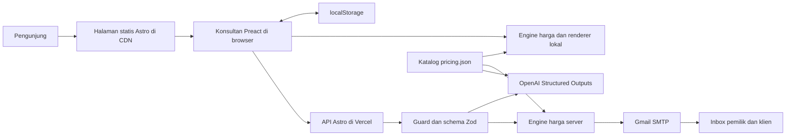
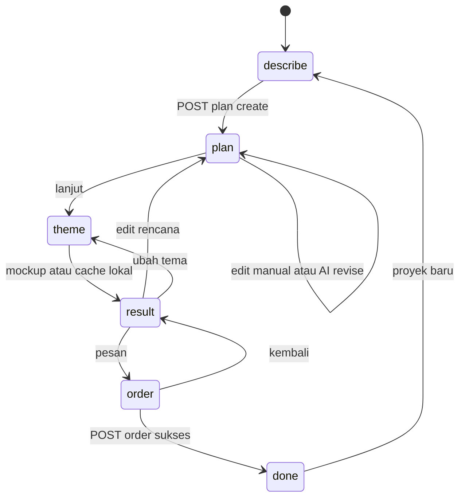

# Arsitektur teknis

## Bentuk sistem

Satu repository dan satu aplikasi Astro. Mayoritas halaman menjadi HTML statis
yang di-cache CDN; endpoint API berjalan dinamis dengan adapter Vercel.
`output: 'static'` tidak berarti seluruh aplikasi hanya file statis: empat
route API menetapkan `prerender = false`. Build lokal memang melaporkan mode
server untuk menghasilkan fungsi dan halaman prerender bersama-sama.



Panah katalog ke AI berarti katalog ID/deskripsi yang dipangkas tanpa angka
harga. Tidak ada state server persisten atau database pada diagram ini.

## Stack yang benar-benar digunakan

Versi berikut dari `package-lock.json` pada 4 Oktober 2026; `package.json`
menggunakan rentang caret. Lockfile menentukan resolusi reproducible.

| Lapisan | Teknologi | Peran |
| --- | --- | --- |
| Runtime/build | Node >=22.12.0, npm, ESM | `.tool-versions`, `type: module` |
| Web framework | Astro 5.18.2 | Routing, prerender, assets, API |
| Island UI | Preact 10.29.8, integration 4.1.3 | State/hook konsultan |
| Bahasa | TypeScript 5.9.3 | `astro/tsconfigs/strict`, JSX Preact |
| Hosting adapter | `@astrojs/vercel` 8.2.11 | Fungsi Node dan static output, maxDuration 60s |
| Sitemap | `@astrojs/sitemap` 3.7.4 | Sitemap + alternate bahasa |
| Validation | Zod 3.25.76 | Input API, parsing output AI, migrasi Plan lama |
| AI | Chat Completions via native fetch | Structured Outputs JSON Schema strict |
| Email | Nodemailer 10.0.10 | Gmail SMTP |
| Test | Vitest 5.0.2 | Engine harga/katalog/promo |
| Browser tooling | playwright-core 1.63.0 | Chrome lokal, E2E/screenshot |
| Images | Astro assets + Sharp 0.35.4 | Optimasi gambar dan generator assets |
| Styles/font | CSS biasa, Plus Jakarta Sans, Caveat | Token global, scoped CSS, font utama lokal |
| Demo terpisah | HTML + React 18.3.1 UMD dari CDN | `public/samples/*/support.js` |

Tidak ada Tailwind, React app utama, router client, ORM, OpenAI SDK, atau
framework backend kedua. Jangan menambah asumsi tool tersebut saat debugging.

## Struktur repository

```text
data/pricing.json             paket, fitur, page types, multiplier, default promo
src/pages/                   wrapper halaman EN/ID + API + robots.txt
src/layouts/Base.astro       shell HTML, SEO, redirect bahasa, reveal script
src/components/landing/      bagian marketing dan demonstrasi konsultasi
src/components/pages/        template ServicePage, ConsultPage, LegalPage
src/components/consult/      island Preact, step UI, preview, stylesheet
src/components/illustrations/ ilustrasi layanan berbasis kode
src/config/site.ts          identitas, kontak, lokasi, sosial, public settings
src/i18n/                   copy EN/ID, katalog bilingual, route pairing
src/lib/                    domain, harga, AI, email, validation, guard
src/lib/mockup/             themes, contoh konten, HTML renderer
src/styles/global.css       font, token, base styles, utilitas visual
src/scripts/reveal.ts       progressive enhancement untuk animasi
src/assets/                 gambar yang dioptimasi Astro
public/                     aset URL tetap dan demo konsep mandiri
scripts/                    generator aset, capture portfolio, browser checks
tests/pricing.test.ts        seluruh unit test saat audit
*.dc.html                   artefak desain/referensi di root
```

`dist/`, `.vercel/output/`, `.astro/`, `node_modules/`, dan `.shots/` bukan
source untuk diedit. `.env.example` adalah kontrak konfigurasi publik untuk developer;
nilai rahasia tidak menjadi dokumentasi proyek.

## Route dan render

| Jenis | EN | ID | Render |
| --- | --- | --- | --- |
| Home | `/` | `/id/` | Static |
| Konsultasi | `/consult/` | `/id/konsultasi/` | Static shell + `client:load` island |
| Layanan | `/services/<slug>/` | `/id/layanan/<slug>/` | 8 per bahasa, `getStaticPaths` |
| Privacy | `/privacy/` | `/id/privasi/` | Static |
| Terms | `/terms/` | `/id/syarat-ketentuan/` | Static |
| API | `/api/plan`, `/api/mockup`, `/api/promo`, `/api/order` | Sama | POST serverless |
| Konsep | `/samples/tegak/`, `/samples/lembar/`, `/samples/arden/`, `/samples/kurohane/` | Tidak dilokalkan berpasangan | File public |

Ada 24 halaman utama berbahasa: 4 jenis umum × 2 + 8 layanan × 2. Robots,
sitemap, dan demo konsep berada di luar hitungan itu. `trailingSlash: 'ignore'`;
helper link/canonical tetap menghasilkan trailing slash.

## Batas modul dan dependensi

- `schemas.ts` membaca ID JSON dan menghasilkan schema/type. Ia tidak memanggil AI.
- `pricing.ts` membaca data/copy, melakukan kalkulasi murni, dan aman digunakan
  browser maupun server. `Choices` diberikan caller, bukan ditebak oleh engine.
- `openai.ts` membaca katalog/schema/theme; membuat konten structured dan
  memakai `publicPages()` untuk brief mockup. Ia berada di server saja.
- API menggabungkan parsing, guard, use case, response. File route sengaja tipis.
- `mail.ts` merakit penawaran menggunakan domain helpers, lalu SMTP.
- `render.ts` adalah fungsi HTML bersama browser/server, bukan komponen Astro.
- `Consultant.tsx` mengorkestrasi state dan request; komponen step menerima
  props dan callback. Tidak ada Redux/context store atau library form.

Jaga agar import island tidak merambat ke `node:crypto`, Nodemailer, secret
runtime, atau modul server lainnya. Data harga dan copy yang diimpor island
memang dapat terlihat publik; tabel kode promo tidak boleh ikut di sana.

## State browser

`State` di `Consultant.tsx` menyimpan step, description/reference, plan,
revision/revisionUsed/note, jawaban, choices, promo terverifikasi, tema,
mockup/key, kontak, dan ID penawaran. Semua State diserialisasi ke
`localStorage['skyland-consult-v2']` setelah hidrasi.



Navigation progress juga memungkinkan kembali ke tahap sebelumnya. Busy/error,
viewport preview, honeypot, dan token Turnstile berada di state transient terpisah.

Saat reload, Plan lama diparse dengan `PlanSchema` agar default terisi. Plan
tidak valid direset ke describe dan mockup dihapus; field State lain tidak
divalidasi menyeluruh. State done direstore sebagai describe tetapi data lain
masih terbawa. Tidak ada TTL, pemisahan storage EN/ID, atau sync multi-tab.

Cache mockup `planKey()` hanya memakai service ID, nama halaman, ID fitur,
dan tema. Perubahan section, brief, quantity, atau flow tidak selalu
menginvalidasi cache; lihat [gap](PROJECT_STATUS.md).

## Visual, assets, dan demo

UI utama menggunakan token warna/font global dan CSS scoped per Astro component.
Konsultan mempunyai CSS `.cs` tersendiri. Preview mockup menggunakan tokens tema
di `themes.ts`, HTML lengkap dari `render.ts`, dan iframe `srcDoc` sandbox tanpa
izin script. Lebar viewport preview: 1.280 desktop / 390 mobile, diskalakan
melalui ResizeObserver.

Font website utama self-hosted melalui Fontsource. HTML mockup dan demo konsep
meminta font Google secara eksternal; mockup tidak sepenuhnya offline walau
HTML/CSS-nya berada dalam satu file. CTA/navigation mockup memakai `href="#"`.

`public/samples/*` dilewatkan langsung sebagai aset; integrasi Astro tidak
mengompilasi HTML/JS di sana. `support.js` memuat React/ReactDOM dari cdnjs dan
mengeksekusi class pada `script[type="text/x-dc"]`. Jangan mengganti bagian
support dengan pola Preact tanpa mengubah keseluruhan demo. Middleware Vite
lokal menyamakan akses `/samples/<nama>/` dengan `index.html` di production.

## SEO dan locale

`routes.ts` merupakan daftar pasangan URL. `Seo.astro` membuat canonical,
hreflang EN/ID/x-default, OG per bahasa, Twitter card, dan optional GSC token.
`jsonld.ts` merakit ProfessionalService/OfferCatalog, Person, WebSite, FAQPage,
Service, dan BreadcrumbList sesuai halaman. Sitemap memakai pairing yang sama
dan memfilter path API; robots juga melarang `/api/`.

`Base.astro` menjalankan redirect EN → ID berdasarkan bahasa browser atau zona
waktu Indonesia, melewati user agent bot dan pilihan manual `skyland-lang`.
Tidak ada redirect server/geolocation IP. `reveal.ts` memakai IntersectionObserver
dan Web Animations, dengan dukungan reduced motion. Tidak ada Astro View
Transitions/router client yang diaktifkan dalam layout.

## Persistensi dan integrasi

Persistensi konsultasi ada di browser; order sukses hidup di inbox pemilik,
dengan JSON lampiran sebagai data lengkap. Rate-limit map hanya hidup di memory
fungsi. QUOTE_SECRET menghasilkan reference HMAC pendek, bukan record quote
yang dapat dicari ulang atau token untuk mengotorisasi scope.

Layanan eksternal runtime: OpenAI, Gmail SMTP, optional Cloudflare Turnstile,
dan WhatsApp berupa link keluar. Tidak ada queue/retry otomatis atau scheduler.
